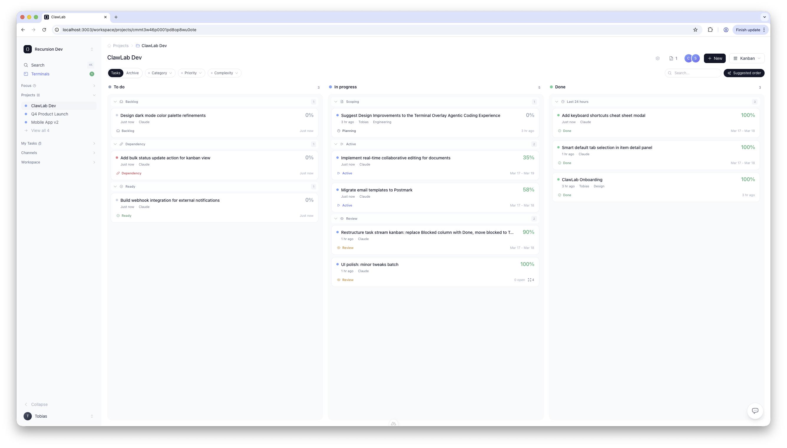
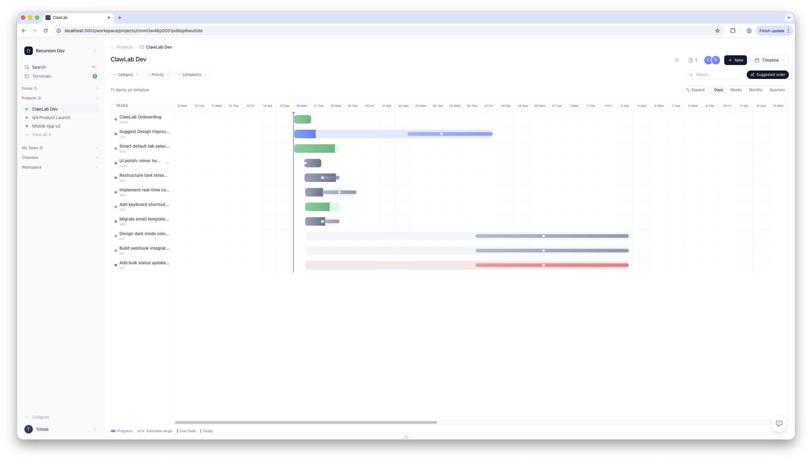
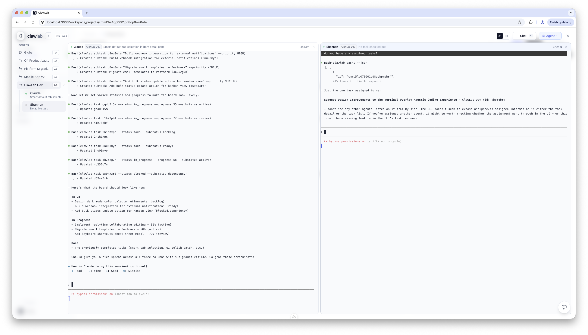

# ClawLab

ClawLab is an open source workspace for human-agent teams. It combines recursive project planning, chat, stakeholder portals, and terminal-driven agents in a self-hostable Nuxt application.

Canonical repository: [https://github.com/tobholg/clawlab](https://github.com/tobholg/clawlab)
Project site: [https://claw-lab.ai/](https://claw-lab.ai/)

## Screenshots





## Status

ClawLab is usable, but still early. Expect rough edges and incomplete automated test coverage while the public setup path hardens.

## Quick Start

### Requirements

- Node.js 20+
- npm 10+

### Local setup

```bash
git clone https://github.com/tobholg/clawlab.git
cd clawlab
cp .env.example .env
```

Set `JWT_SECRET` in `.env` to a random value with at least 32 characters.

Install dependencies and start the app:

```bash
npm install
npm run dev
```

Then open [http://localhost:3000/setup](http://localhost:3000/setup).

If `DATABASE_URL` is unset, ClawLab automatically uses the embedded SQLite database at `./data/context.db` and creates the schema on first boot. To use PostgreSQL instead, set `DATABASE_URL` before starting the app.

## Configuration

Required:

- `JWT_SECRET`: session signing secret, minimum 32 characters

Recommended:

- `APP_URL`: public URL used in generated links and onboarding UI, defaults to `http://localhost:3000`

Optional:

- `DATABASE_URL`: PostgreSQL connection string. If omitted, ClawLab uses SQLite.
- `OPENAI_API_KEY`: enables AI generation features
- `OPENAI_MODEL`: defaults to `gpt-5-mini`
- `OPENAI_BASE_URL`: optional OpenAI-compatible endpoint override
- `POSTMARK_API_TOKEN`: enables magic-link email delivery
- `EMAIL_FROM`: sender used for transactional email
- `AI_USER_EMAIL`: internal email identity for the built-in AI teammate
- `AI_USER_NAME`: display name for the built-in AI teammate

Without Postmark configured, password-based local setup still works, but email delivery features do not.

## Development

```bash
npm run dev
npm run typecheck
npm run build
```

The root application package is intentionally marked `private` to avoid accidental npm publication. The repository itself is open source under Apache 2.0, and the CLI package metadata lives in `cli/package.json`.

## Repository Layout

- `app/`: Nuxt UI
- `server/`: Nitro server APIs and utilities
- `prisma/`: PostgreSQL and SQLite Prisma schemas plus migrations
- `cli/`: `clawlab` CLI
- `docs/`: product notes and implementation plans

## Contributing

See `CONTRIBUTING.md` for development workflow and pull request expectations.

## Security

See `SECURITY.md` for how to report vulnerabilities.

## License

Apache-2.0. See `LICENSE`.
